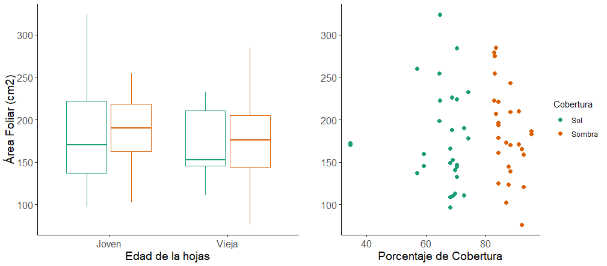

**Aquí yo puedo  _cambiar_ el texto dependiendo de lo que yo quiera agregar**

Rosas son rojas, y las violetas son azules

Para realizar el experimento necesario para responder mi pregunta de investigación, necesito hacer mediciones diarias en el sitio de estudio durante 30 días, para así asegurar que los datos son lo suficientemente robustos y poder efectuar un análisis que permita entender el fenómeno estudiado. Estoy aplicando a la beca de la Organización de Estudios Tropicales (OET) para cubrir los gastos necesarios para cubrir el alojamiento, la alimentación y los permisos de investigación en la Estación La Selva durante este tiempo. Los gastos derivados de transporte y materiales, estarán cubiertos por el sistema de becas Sigma Xi. Cualquier apoyo que la OET pueda proveer será una contribución invaluable para contribuir a la generación y a la divulgación de ciencia. 

[Página](https://www.linkedin.com/)

